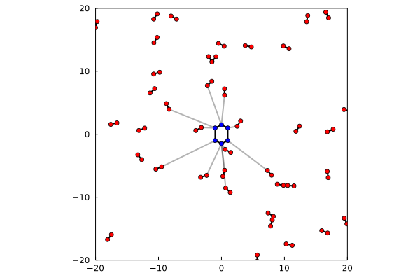

# User guide

Here the usage of the functions that allocate the list of distances will be described. Different running modes are available depending on the expected output.

## Installation and loading

To install `MolecularMinimumDistances`, first download and install Julia (1.6 or greater) from [https://julialang.org/downloads/](https://julialang.org/downloads). Install and run it. Then, use:

```julia-repl
julia> import Pkg; Pkg.add("MolecularMinimumDistances")

julia> using MolecularMinimumDistances
```

## Example input files

The examples here use a molecular system, but the package actually only considers the coordinates of the atoms and the number of atoms of each molecule. Thus, more general distance problems can be tackled.

The input of the following tests can be obtained with:

```julia-repl
julia> using PDBTools

julia> system = MolecularMinimumDistances.download_example() 
   Array{Atoms,1} with 62026 atoms with fields:
   index name resname chain   resnum  residue        x        y        z  beta occup model segname index_pdb
       1    N     ALA     A        1        1   -9.229  -14.861   -5.481  0.00  1.00     1    PROT         1
       2  HT1     ALA     A        1        1  -10.048  -15.427   -5.569  0.00  0.00     1    PROT         2
       3  HT2     ALA     A        1        1   -9.488  -13.913   -5.295  0.00  0.00     1    PROT         3
                                                       ⋮ 
   62024  OH2    TIP3     C     9339    19638   13.485   -4.534  -34.438  0.00  1.00     1    WAT2     62024
   62025   H1    TIP3     C     9339    19638   13.218   -3.647  -34.453  0.00  1.00     1    WAT2     62025
   62026   H2    TIP3     C     9339    19638   12.618   -4.977  -34.303  0.00  1.00     1    WAT2     62026

```
The system consists of a protein (with 1463 atoms), solvated by 181 TMAO molecules (with 14 atoms each), 19338 water molecules, and some ions. 

This is a snapshot of a simulation which was performed with cubic periodic boundary conditions, with a box side of `84.48` Angstrom. We will use periodic boundary conditions in the examples. 

The coordinates of each of the types of molecules can be extracted from the `system` array of atoms with (using `PDBTools` - v0.13 or greater):

```julia-repl
julia> protein = coor(system,"protein")
1463-element Vector{StaticArrays.SVector{3, Float64}}:
 [-9.229, -14.861, -5.481]
 [-10.048, -15.427, -5.569]
 [-9.488, -13.913, -5.295]
 ⋮
 [6.408, -12.034, -8.343]
 [6.017, -10.967, -9.713]

julia> tmao = coor(system,"resname TMAO")
2534-element Vector{StaticArrays.SVector{3, Float64}}:
 [-23.532, -9.347, 19.545]
 [-23.567, -7.907, 19.381]
 [-22.498, -9.702, 20.497]
 ⋮
 [13.564, -16.517, 12.419]
 [12.4, -17.811, 12.052]

julia> water = coor(system,"water")
58014-element Vector{StaticArrays.SVector{3, Float64}}:
 [-28.223, 19.92, -27.748]
 [-27.453, 20.358, -27.476]
 [-27.834, 19.111, -28.148]
 ⋮
 [13.218, -3.647, -34.453]
 [12.618, -4.977, -34.303]
```

Using these vectors of coordinates, we will illustrate the use of the current package.

## Shortest distances from a solute

The simplest usage consists of finding for each molecule of one set the atoms of the other set which are closer to them. For example, if we want the atoms of the proteins which are closer to each TMAO molecule (14 atoms), within a cutoff of `12.0` Angstroms, we do:

!!! note
    If the solute has more than one molecule, this will not be taken into 
    consideration in this mode. All molecules will be considered as part
    of the same structure (the number of atoms per molecule of the `protein` is not a parameter here).

### Without periodic boundary conditions

```julia-repl
julia> list = minimum_distances(tmao, protein, 14, 12.0)
181-element Vector{MinimumDistance{Float64}}:
 MinimumDistance{Float64}(false, 0, 0, Inf)
 MinimumDistance{Float64}(false, 0, 0, Inf)
 MinimumDistance{Float64}(false, 0, 0, Inf)
 ⋮
 MinimumDistance{Float64}(false, 0, 0, Inf)
 MinimumDistance{Float64}(true, 2526, 97, 9.652277658666891)
```

The list obtained contains, for each molecule of TMAO, a structure of type `MinimumDistance`, containing:
1. A boolean marker, which is `true` if some protein atom was found within the desired cutoff, `false` otherwise (field `x.within_cutoff`).
2. The index of the TMAO atom (field `x.i`).
3. The index of the protein atom (field `x.j`).
4. The distance between these atoms (field `x.d`).

For instance, the number of molecules of TMAO having a protein atom within the cutoff are, here:
```julia-repl
julia> count(x -> x.within_cutoff, list)
33
```

For each molecule of water, he have, similarly:

```julia-repl
julia> list = minimum_distances(water,protein,3,12.)
19338-element Vector{MinimumDistance{Float64}}:
 MinimumDistance{Float64}(false, 0, 0, Inf)
 MinimumDistance{Float64}(false, 0, 0, Inf)
 MinimumDistance{Float64}(false, 0, 0, Inf)
 ⋮
 MinimumDistance{Float64}(true, 58011, 383, 10.24673074692606)
 MinimumDistance{Float64}(false, 0, 0, Inf)

julia> count(x -> x.within_cutoff, list)
2251
```

A pictorial representatio of this result, for a simpler system, is:



This figure illustrate that all distances between the solute (blue) and the closet atoms of each solvent molecule (red) were found, within the desired cutoff. 

### With periodic boundary conditions

The example simulation was performed with cubic periodic boundary conditions. Let us provide the box information now. We will exemplify with the calculation of the nearest atoms of the water molecules. The interface here is that define by the `Box` constructor of `CellListMap.jl`, described in detail [here](https://m3g.github.io/CellListMap.jl/stable/pbc/). General periodic boundary conditions are supported. 

The box here is cubic, and we need to provide to the `Box` constructor the sides and the cutoff:

```julia-repl
julia> box = Box([84.48, 84.48, 84.48], 12.)
Box{CellListMap.OrthorhombicCell, 3, Float64, Float64, 9}
  unit cell matrix = [ 84.48, 0.0, 0.0; 0.0, 84.48, 0.0; 0.0, 0.0, 84.48 ]
  cutoff = 12.0
  number of computing cells on each dimension = [9, 9, 9]
  computing cell sizes = [12.06857142857143, 12.06857142857143, 12.06857142857143] (lcell: 1)
  Total number of cells = 729
```

And the `minimum_distance` function is called with the `box` instead of the `cutoff`:

```julia-repl
julia> list = minimum_distances(water,protein,3,box)
19338-element Vector{MinimumDistance{Float64}}:
 MinimumDistance{Float64}(false, 0, 0, Inf)
 MinimumDistance{Float64}(false, 0, 0, Inf)
 MinimumDistance{Float64}(false, 0, 0, Inf)
 ⋮
 MinimumDistance{Float64}(true, 58011, 383, 10.24673074692606)
 MinimumDistance{Float64}(false, 0, 0, Inf)
```

## All shortest distances

A similar call of the previous section can be used to compute, for each molecule of a set of molecules, which is the closest atom
of every other molecule of another set. 

In the example, we can compute for each TMAO molecule, which is the closest atom of water, and vice-versa. The difference from the previous call
is that now wee need to provide the number of atoms of both TMAO and water:

```julia-repl
julia> water_list, tmao_list = minimum_distances(water, tmao, 3, 14, box);

julia> water_list
19338-element Vector{MinimumDistance{Float64}}:
 MinimumDistance{Float64}(true, 2, 1512, 4.779476331147592)
 MinimumDistance{Float64}(true, 6, 734, 2.9413928673334357)
 MinimumDistance{Float64}(true, 8, 859, 5.701548824661595)
 ⋮
 MinimumDistance{Float64}(true, 58010, 1728, 3.942870781549911)
 MinimumDistance{Float64}(true, 58014, 2058, 2.2003220218867936)

julia> tmao_list
181-element Vector{MinimumDistance{Float64}}:
 MinimumDistance{Float64}(true, 12, 22520, 2.1985345118965056)
 MinimumDistance{Float64}(true, 20, 33586, 2.1942841657360606)
 MinimumDistance{Float64}(true, 37, 26415, 2.1992319113726926)
 ⋮
 MinimumDistance{Float64}(true, 2512, 37323, 2.198738501959709)
 MinimumDistance{Float64}(true, 2527, 33664, 2.1985044916943015)
```

Two lists were returned, the first containing, for each water molecule, `MinimumDistance` data associated to the closest TMAO molecule
(meaning the atoms involved in the contact and their distance). Similary, the second list contains, for each TMAO molecule, the `MinimumDistance` data associated to each TMAO molecule. 

## Shortest distances within molecules

There is an interface to compute the shortest distance *within* a set of molecules. That is, given one group of molecules, compute for each molecule which is the shortest distance among the other molecules of the same type. 

A typical call would be:

```julia-repl
julia> list = minimum_distances(water, 3, box)
19338-element Vector{MinimumDistance{Float64}}:
 MinimumDistance{Float64}(true, 2, 33977, 2.1997806708851724)
 MinimumDistance{Float64}(true, 4, 43684, 2.1994928961012814)
 MinimumDistance{Float64}(true, 9, 28030, 2.1997583958244142)
 ⋮
 MinimumDistance{Float64}(true, 58010, 22235, 2.1992096307537414)
 MinimumDistance{Float64}(true, 58012, 9318, 2.20003227249056)
```

Which contains for each water molecule the atoms involved in the closest contact to any other water molecule, and the distances (within the cutoff).
A pictorial representation of a result of this type is, for a simpler system:


This can be used for the identification of connectivity networks, for example, or for some types of clustering.

!!! note
    All the function accept either a `cutoff` (a `Real` value) or a `Box` in the same argument positions. If the cutoff only is provided, it is assumed that no periodic boundary conditions are used. 


