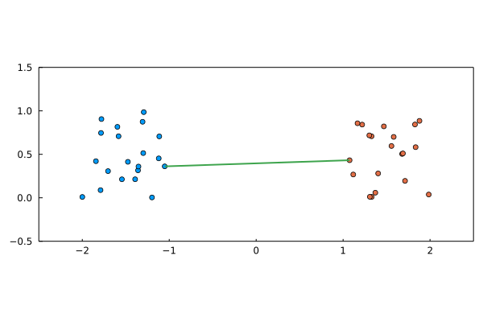

# MolecularMinimumDistances

[MolecularMinimumDistancs.jl](http://github.com/m3g/MolecularMinimumDistances.jl) computes the minimum distance between *molecules*, which are represented as arrays of coordinates in two or three dimensions. 

To understand the utility and purpose of this package, consider the image below:



Here, there is one *blue* molecule, with 6 atoms, and several *red* molecules, with 2 atoms each. The package has identified which are the molecules of the *red* set that have at leat one atom within a cutoff from the atoms of the *blue* molecule, and annotated the corresponding atoms and the distances.

## Features

- Fast [cell-list approach](https://github.com/m3g/CellListMap.jl), to compute minimum-distance for thousands, or millions of atoms. 
- General periodic boundary conditions supported. 
- Advanced mode for in-place calculations, for non-allocating iterative calls (for analysis of MD trajectories, for example).
- Modes for the calculation of minimum-distances in sets of molecules.

## Most typical use: Understanding solvation

This package was designed as the backend for computing [minimum distance distribution functions](http://m3g.github.io/ComplexMixtures.jl), which are useful for understanding solute-solvent interactions when the molecules have complex shapes. 

The most typical scenario is that of a protein, or another macromolecule, in a box of solvent. For example, here we download a frame of a protein which was simulated in a mixture of water and TMAO: 

```julia-repl
julia> using PDBTools

julia> system = MolecularMinimumDistances.download_example()
   Array{Atoms,1} with 62026 atoms with fields:
   index name resname chain   resnum  residue        x        y        z  beta occup model segname index_pdb
       1    N     ALA     A        1        1   -9.229  -14.861   -5.481  0.00  1.00     1    PROT         1
       2  HT1     ALA     A        1        1  -10.048  -15.427   -5.569  0.00  0.00     1    PROT         2
       3  HT2     ALA     A        1        1   -9.488  -13.913   -5.295  0.00  0.00     1    PROT         3
                                                       ⋮ 
   62024  OH2    TIP3     C     9339    19638   13.485   -4.534  -34.438  0.00  1.00     1    WAT2     62024
   62025   H1    TIP3     C     9339    19638   13.218   -3.647  -34.453  0.00  1.00     1    WAT2     62025
   62026   H2    TIP3     C     9339    19638   12.618   -4.977  -34.303  0.00  1.00     1    WAT2     62026
```

Next, we extract the protein coordinates, and the TMAO coordinates:

```julia-repl
julia> protein = coor(system,"protein")
1463-element Vector{SVector{3, Float64}}:
 [-9.229, -14.861, -5.481]
 [-10.048, -15.427, -5.569]
 [-9.488, -13.913, -5.295]
 ⋮
 [6.408, -12.034, -8.343]
 [6.017, -10.967, -9.713]

julia> tmao = coor(system,"resname TMAO")
2534-element Vector{SVector{3, Float64}}:
 [-23.532, -9.347, 19.545]
 [-23.567, -7.907, 19.381]
 [-22.498, -9.702, 20.497]
 ⋮
 [13.564, -16.517, 12.419]
 [12.4, -17.811, 12.052]
```

The system was simulated with periodic boundary conditions, with sides in this frame of `[83.115, 83.044, 83.063]`, and this information will be provided to the minimum-distance computation.

Finally, we find all the TMAO molecules having at least one atom closer than 12 Angstroms to the protein, using the current package (TMAO has 14 atoms):

```julia-repl
julia> list = minimum_distances(
           xpositions=tmao, # solvent
           ypositions=protein, # solute
           xn_atoms_per_molecule=14,
           cutoff=12.0,
           unitcell=[83.115, 83.044, 83.063]
       )
181-element Vector{MinimumDistance{Float64}}:
 MinimumDistance{Float64}(false, 0, 0, Inf)
 MinimumDistance{Float64}(false, 0, 0, Inf)
 ⋮
 MinimumDistance{Float64}(true, 2526, 97, 9.652277658666891)

julia> count(x -> x.within_cutoff, list)
33
```

Thus, 33 TMAO molecules are within the cutoff distance from the protein, and the distances can be used to study the solvation of the protein.

## Performance

This package exists because this computation is fast. For example, let us choose the water molecules instead, and benchmark the time required to compute this set of distances:
```julia-repl
julia> water = coor(system,"resname TIP3")
58014-element Vector{SVector{3, Float64}}:
 [-28.223, 19.92, -27.748]
 [-27.453, 20.358, -27.476]
 [-27.834, 19.111, -28.148]
 ⋮
 [13.218, -3.647, -34.453]
 [12.618, -4.977, -34.303]

julia> using BenchmarkTools

julia> @btime minimum_distances(
           xpositions=$water, # solvent
           ypositions=$protein, # solute
           xn_atoms_per_molecule=3,
           cutoff=12.0,
           unitcell=[83.115, 83.044, 83.063]
       );
  6.288 ms (3856 allocations: 13.03 MiB)
```

To compare, a naive algorithm to compute the same thing takes roughly 400x more for this
system size:

```julia-repl
julia> @btime MolecularMinimumDistances.naive_md($water, $protein, 3, [83.115, 83.044, 83.063], 12.0);
  2.488 s (97 allocations: 609.16 KiB)
```

And the computation can be made faster and in-place using the more advanced interface that allows preallocation of main necessary arrays:

```julia-repl
julia> sys = CrossPairs(
           xpositions=water, # solvent
           ypositions=protein, # solute
           xn_atoms_per_molecule=3,
           cutoff=12.0,
           unitcell=[83.115, 83.044, 83.063]
       )
CrossPairs system with:

Number of atoms of set: 58014
Number of atoms of target structure: 1463
Cutoff: 12.0
unitcell: [83.12, 0.0, 0.0, 0.0, 83.04, 0.0, 0.0, 0.0, 83.06]
Number of molecules in set: 4144

julia> @btime minimum_distances!($sys);
  2.969 ms (196 allocations: 22.80 KiB)
```

The remaining allocations occur only for the launching of multiple threads:

```julia-repl
julia> sys = CrossPairs(
           xpositions=water, # solvent
           ypositions=protein, # solute
           xn_atoms_per_molecule=14,
           cutoff=12.0,
           unitcell=[83.115, 83.044, 83.063],
           parallel=false # default is true
       );

julia> @btime minimum_distances!($sys);
  15.249 ms (0 allocations: 0 bytes)
```

## Details of the illustration

The initial illustration here consists of a toy solute-solvent example, where the solute is an approximately hexagonal molecule, and the solvent is composed by 40 diatomic molecules. The toy system is built as follows:

```julia
using MolecularMinimumDistances, StaticArrays
# x will contain the "solvent", composed by 40 diatomic molecules
T = SVector{2,Float64}
x = T[]
cmin = T(-20,-20)
for i in 1:40
    v = cmin .+ 40*rand(T)
    push!(x, v)
    theta = 2pi*rand()
    push!(x, v .+ T(sin(theta),cos(theta)))
end
# y will contain the "solute", composed by an approximate hexagonal molecule
y = [ T(1,1), T(1,-1), T(0,-1.5), T(-1,-1), T(-1,1), T(0,1.5) ]
```

Next, we compute the minimum distances between each molecule of `x` (the solvent)
and the solute. In the input we need to specify the number of atoms of each molecule
in `x`, and the cutoff up to which we want the distances to be computed:

```julia-repl
julia> list = minimum_distances(
           xpositions=x,
           ypositions=y,
           xn_atoms_per_molecule=2,
           unitcell=[40.0, 40.0],
           cutoff=10.0
       )
40-element Vector{MinimumDistance{Float64}}:
 MinimumDistance{Float64}(true, 2, 3, 1.0764931248364737)
 MinimumDistance{Float64}(false, 0, 0, Inf)
 MinimumDistance{Float64}(false, 0, 0, Inf)
 ⋮
 MinimumDistance{Float64}(true, 74, 5, 7.899981412729262)
 MinimumDistance{Float64}(false, 0, 0, Inf)
```

The output is a list of `MinimumDistance` data structures, one for each molecule in `x`. The `true` indicates that a distance smaller than the cutoff was found, and for these the indexes of the atoms in `x` and `y` associated are reported, along with the distance between them.

In this example, from the 40 molecules of `x`, eleven had atoms closer than the cutoff to some
atom of `y`:
```julia-repl
julia> count(x -> x.within_cutoff, list)
11
```

We have an auxiliary function to plot the result, in this case where the "atoms" are bi-dimensional:

```julia
using Plots
import MolecularMinimumDistances: plot_md!
p = plot(lims=(-20,20),framestyle=:box,grid=false,aspect_ratio=1)
plot_md!(p, x, 2, y, 6, list, y_cycle=true)
```
will produce the illustration plot above, in which the nearest point between the two sets is identified.

